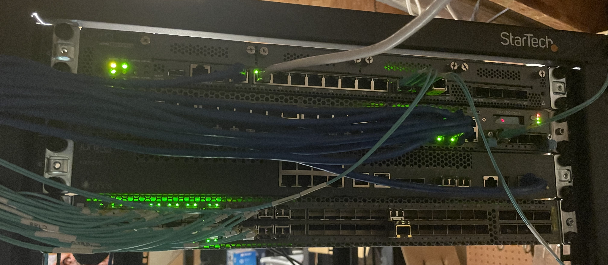

## About Me

I am a 20-year-old systems engineer focused on automation, infrastructure architecture, and enterprise networking.
I specialize in diving into complex environments and finding ways to make them automated and efficient.

## Skills & Technologies

* **Linux & Systems:** Red Hat Certified Engineer (RHCE). Experience across Linux, AIX, HP-UX, and Solaris,
      as well as architectures such as Itanium, PA-RISC, POWER, and SPARC.
* **Networking:** Configuring and managing Juniper and Brocade environments.
* **Automation:** Building infrastructure as code and streamlining workflows using Ansible and Puppet.
