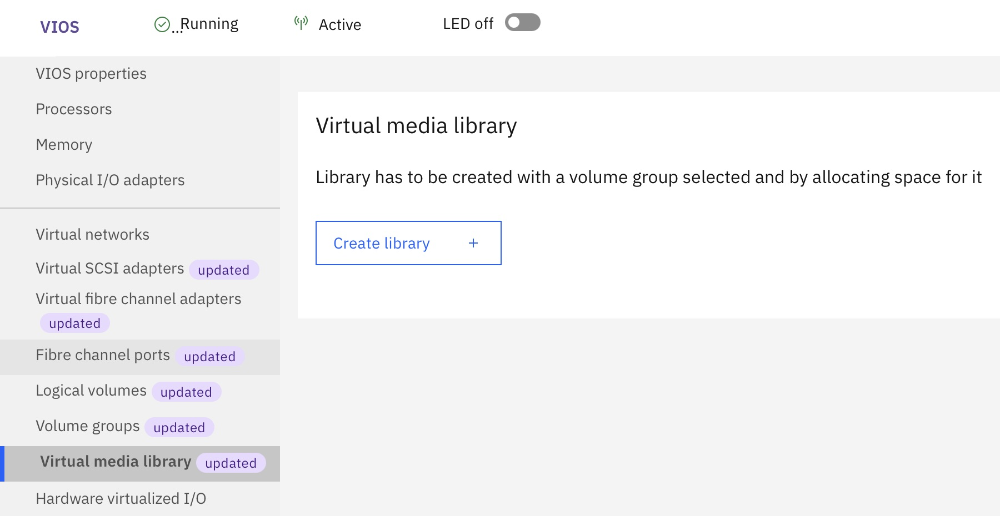
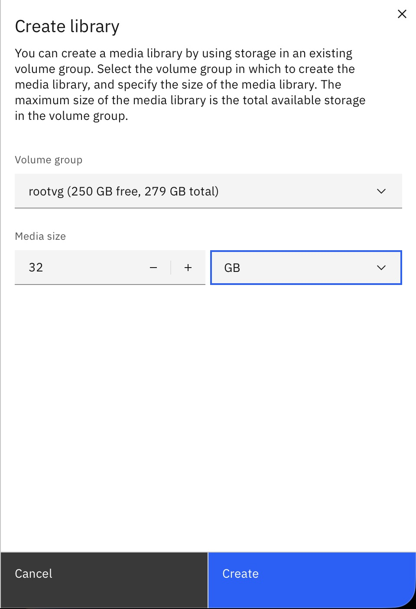
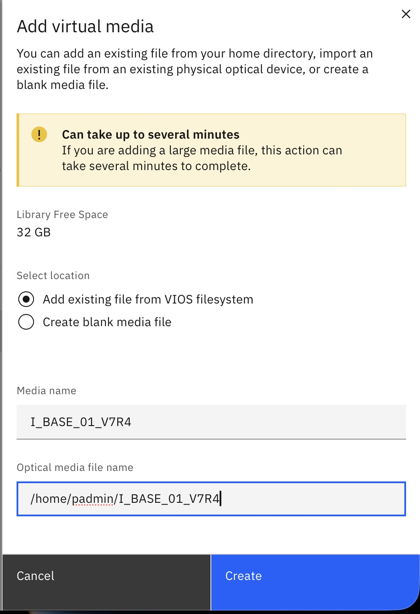

While working on part 2 of my public infrastructure project, I've been trying to get a license for my IBM S822 to allow
me to run more than two LPARS. I would like to provide individual LPARs to users for security and also to get the full
capacity out of my hardware. I have been in contact with [Midland Information Systems](https://midlandinfosys.com), an
IBM business partner offering solutions for various IBM products. During the process, I was tasked with this:

```text
Hey Bryant, 

Just heard back actually. Will now need the configuration of the system. 

Are you able to print to PDF a rack configuration from the machine and send it to me please?

How to Print the System Configuration List:
1. On the AS/400 Main menu command line type:
STRSST.
Press the Enter key.
2. On the STRSST display, select Start a service tool option. Press the Enter key.
3. On the Start a Service Tool display, select Hardware service manager. Press the Enter key.
4. From the Hardware Service Manager display, press F6 (print configuration).
5. To return to the AS/400 Main menu, Press F3 (Exit) twice and then press the Enter key.
6. Keep the printed list - the service representative will need it
7. Release print job..
```

Obviously, this requires an IBM i partition to be installed. This post is going to go through the process I took
installing IBM i.

## Prerequisites

My method involved installing IBM i in a logical partition. You could install it on a server in standalone mode, but
since I want to run other LPARs on my S822 server I went with installing it in a logical partition. **You will need an
HMC/vHMC and VIOS partition to do this.** I can't explain the installation of those in detail in this blog post as
it would take too long. But just know that you'll need an HMC for managing the server and a VIOS for handling I/O for
the LPARS.

You will also need IBM i install media. You do not stricly need a license for temporary installs of IBM i. IBM provides
an [article](https://www.ibm.com/docs/en/entitled-systems-support?topic=software-i-evaluation-nlv-download) detailing
how you you obtain them. You'll need to create an IBM id so you can access Entitled Systems Support (ESS) to download
the evaluation images. I'll be using IBM i v7R4 since it's the latest version that my S822 supports. You can choose
to download the files through ESS with IBM's Download Director (recommended for bulk downloads, requires an application
such as OpenWebStart or IcedTea-Web since it uses `.jnlp` files) or with HTTP (recommended for downloading individual
files).

For a basic install, you'll need the following files:

- Licensed internal code (usually begins with I_BASE)
- B_GROUP files, which contains the OS files and libraries

The files will either appear in `.iso` or `.udf` format. This does not matter.

By the way, in case you feel I'm explaining too poorly or need more detail, IBM provides a detailed guide
[on their website](https://www.ibm.com/docs/en/i/7.6.0?topic=partition-installing-i-release). Just don't forget to
change the version to the one you'll be installing.

## Preparation

Before we can begin to install, you'll need to do three things:

- Create a Virtual Media Library on the VIOS, from the HMC
- Upload the OS files to the VIOS (e.g. through SCP)
- Import the OS files into the Virtual Media Library

To create the Virtual Media Library, just navigate to the VIOS partition you want to create it on. Then, you can click
on the Virtual Media Library tab and create one:



When prompted to create one, choose the volume group to create it on and its size:



Now, the volume group should be created. You can begin by uploading the needed OS files to your VIOS like this:

`scp <filename> padmin@<vios_hostname>:/home/padmin/`

This will upload the file to the home directory of your VIOS user. When completed, you'll be able to import the file
into the Virtual Media Library by clicking the add button:



Where `Media name` is the name of the file as it should appear in the Virtual Media Library, and
`Optical media file name` is the full path of the location of the media file (e.g. `/home/padmin/<filename>`).

After clicking create, you can upload more files as needed to the VIOS. During this workflow, I recommend deleting the
source files from the home directory of `padmin` to create room for subsequent uploads and to prevent filling up the
VIOS filesystem.
