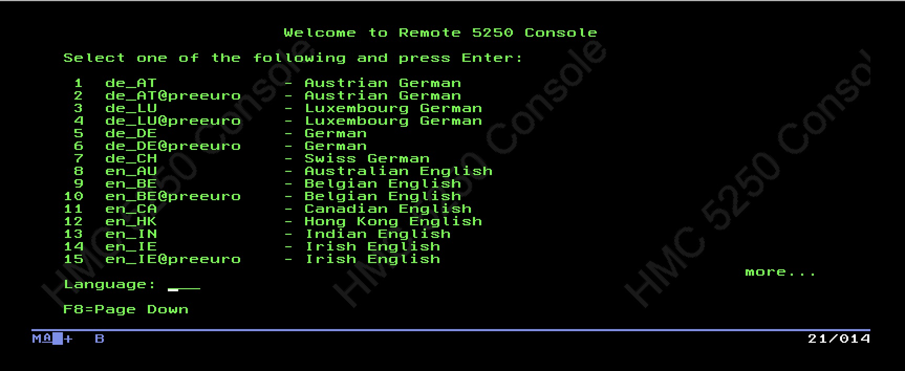
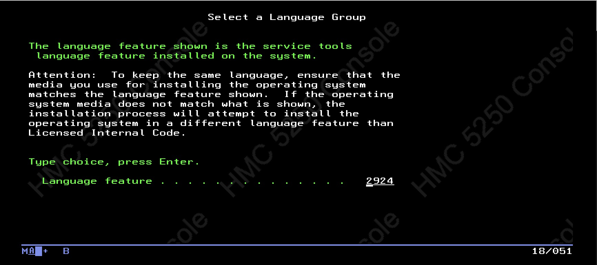
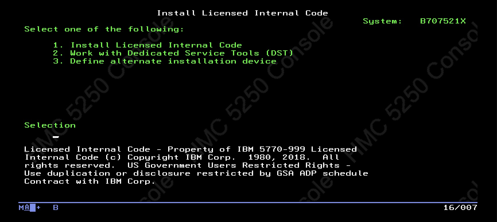

While working on part 2 of my public infrastructure project, I've been trying to get a license for my IBM S822 to allow
me to run more than two LPARS. I would like to provide individual LPARs to users for security and also to get the full
capacity out of my hardware. I have been in contact with [Midland Information Systems](https://midlandinfosys.com), an
IBM business partner offering solutions for various IBM products. During the process, I was tasked with this:

```text
Hey Bryant, 

Just heard back actually. Will now need the configuration of the system. 

Are you able to print to PDF a rack configuration from the machine and send it to me please?

How to Print the System Configuration List:
1. On the AS/400 Main menu command line type:
STRSST.
Press the Enter key.
2. On the STRSST display, select Start a service tool option. Press the Enter key.
3. On the Start a Service Tool display, select Hardware service manager. Press the Enter key.
4. From the Hardware Service Manager display, press F6 (print configuration).
5. To return to the AS/400 Main menu, Press F3 (Exit) twice and then press the Enter key.
6. Keep the printed list - the service representative will need it
7. Release print job..
```

Obviously, this requires an IBM i partition to be installed. This post is going to go through the process I took
installing IBM i.

## Prerequisites

My method involved installing IBM i in a logical partition. You could install it on a server in standalone mode, but
since I want to run other LPARs on my S822 server I went with installing it in a logical partition. **You will need an
HMC/vHMC and VIOS partition to do this.** I can't explain the installation of those in detail in this blog post as
it would take too long. But just know that you'll need an HMC for managing the server and a VIOS for handling I/O for
the LPARS.

You will also need IBM i install media. You do not strictly need a license for temporary installs of IBM i. IBM provides
an [article](https://www.ibm.com/docs/en/entitled-systems-support?topic=software-i-evaluation-nlv-download) detailing
how you you obtain them. You'll need to create an IBMid so you can access Entitled Systems Support (ESS) to download
the evaluation images. I'll be using IBM i V7R4 since it's the latest version that my S822 supports. You can choose
to download the files through ESS with IBM's Download Director (recommended for bulk downloads, requires an application
such as OpenWebStart or IcedTea-Web since it uses `.jnlp` files) or with HTTP (recommended for downloading individual
files).

For a basic install, you'll need the following files:

- Licensed internal code (usually begins with I_BASE)
- B_GROUP files, which contains the OS files and libraries

The files will either appear in `.iso` or `.udf` format. This does not matter.

By the way, in case you feel I'm explaining too poorly or need more detail, IBM provides a detailed guide
[on their website](https://www.ibm.com/docs/en/i/7.6.0?topic=partition-installing-i-release). Just don't forget to
change the version to the one you'll be installing.

## Preparation

Before we can begin to install, you'll need to do three things:

- Create a Virtual Media Library on the VIOS, from the HMC
- Upload the OS files to the VIOS (e.g. through SCP)
- Import the OS files into the Virtual Media Library

To create the Virtual Media Library, just navigate to the VIOS partition you want to create it on. Then, you can click
on the Virtual Media Library tab and create one:


When prompted to create one, choose the volume group to create it on and its size:


Now, the volume group should be created. You can begin by uploading the needed OS files to your VIOS like this:

`scp <filename> padmin@<vios_hostname>:/home/padmin/`

This will upload the file to the home directory of your VIOS user. When completed, you'll be able to import the file
into the Virtual Media Library by clicking the add button:


Where `Media name` is the name of the file as it should appear in the Virtual Media Library, and
`Optical media file name` is the full path of the location of the media file (e.g. `/home/padmin/<filename>`).

After clicking create, you can upload more files as needed to the VIOS. During this workflow, I recommend deleting the
source files from the home directory of `padmin` to create room for subsequent uploads and to prevent filling up the
VIOS filesystem.

With the appropriate files uploaded, you can proceed with creating the IBM i partition. On the HMC, navigate to the
system you want to create the partition and select create partition(s) under system actions. Set the name and resource
allocations you want for the partition, then set the partition type to IBM i and click OK.

After creating the partition, you can proceed with assigning virtual networks, storage, etc. to the partition.
For my usecase, I'll just create a logical volume for the partition boot disk.

> **Note**: IBM i expects 520 byte disks. If you're assigning a physical volume/installing without an HMC, make sure to
> use 520 byte disks. If you're using a VIOS, you can disregard this. It will handle the translation from 520 byte to
> whatever backend disks you're using (e.g. 512, 528).

Now you can create a virtual optical device for the LPAR and load the Licensed Internal Code (LIC) ISO to it.
But wait! **Don't start the partition yet!**. IBM i has some specific quirks due to its age. You'll need to navigate
to partition properties and verify IPL source is set to `D`. That tells the partition to look at the CDROM instead of
booting from disk (which would be IPL source `A`). Also make sure key lock position is set to `Manual`, not `Normal`.
This tells the partition that you want to interact with it instead of booting hands-free. Also, under
`Advanced Settings`, click on `Tagged I/O Settings` and set the `Alternate Restart Device` to the CDROM vSCSI device
so that the partition knows where to boot from.

## Connecting to the LPAR

Unlike an AIX/Linux partition, IBM i doesn't just use a standard terminal device to view the console. IBM i exclusively
uses the 5250 protocol to connect to it (like how IBM Z/OS uses the 3270 protocol). As such, you'll need a way to access
the console output. If you're using a console connected to the HMC (or VNC if using vHMC), you can activate the
partition like normal and then click on `Console` in the partitions menu and open a 5250 console to it. However, this
isn't possible if you're accessing the HMC from a browser. In this case, I recommend using IBM i Access Client
Solutions. If you're not interested, you can skip to the next section.

IBM i Access Client solutions is IBM's native tool for connecting to IBM i partitions. One of its killer features is
that it supports connecting directly to the HMC, which runs a 5250 console internally to allow you to view IBM i
partition consoles. You can read
[IBM's detailed guide here](https://www.ibm.com/support/pages/ibm-i-access-acs-quick-start-guide) for getting it set up.
If you're on macOS/Linux, you will also need to install `UnixODBC` in addition to Java in order to use the application
correctly.

After everything's been installed, you'll need to open ACS, click on `System Configurations` under `Management`,
and click `New` to add a new "system". If you were connecting to an existing IBM i server, with TCP/IP and whatnot
already configured, you could add it directly under `General`. But since we're using the HMC to view the console of the
IBM i partition, click on `Console` instead, select `HMC 5250 Console`, and enter the hostname/IP address of the HMC
(you can still add a short name and description for the HMC under `General` so that the HMC can be found in
`System Configurations`). I recommend keeping `Use SSL for connection` enabled since the HMC already comes with
existing SSL certificates for the web interface. Also make sure that your firewall rules, either between your computer
and the HMC, or on the HMC directly, allow ports 2300/2301 over HTTP/HTTPS for console access
[as written here](https://www.ibm.com/support/pages/tcpip-ports-required-ibm-i-access-and-related-functions).

After you've clicked `Save/New`, you can select `5250 Console` under `Console` to test the connection. If you've done
everything correctly, you should see a screen like this:



For US English, you can type 21. Then you can login with your regular HMC credentials, select the managed system,
and choose the IBM i partition you want to connect to.

## Installation

The partition should be booted, and you should be greeted with this screen:



You can keep the 2924 option set on the next two screens if you want to continue using US English. You'll then be
greeted with this screen, to which you can just select `1`.



The rest of the install should be pretty self-explanatory; for the next screen, you can select `2` to
`Install Licensed Internal Code and Initialize system` since this a new install. Then hit `F10` to start.

> **Tip**: If your keyboard doesn't have function keys, you can click on `Keypad` under `View` to enable the on-screen
> function keys.
