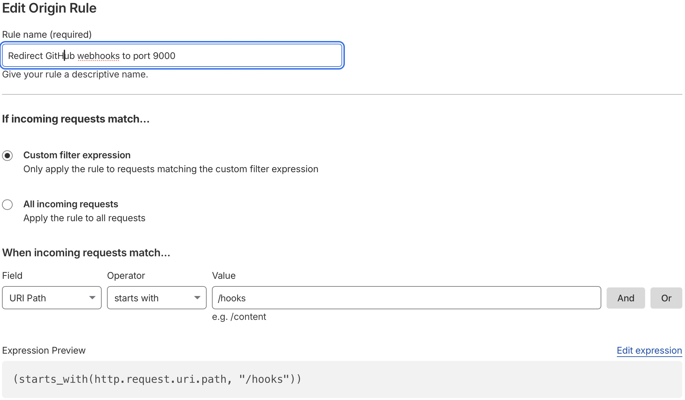
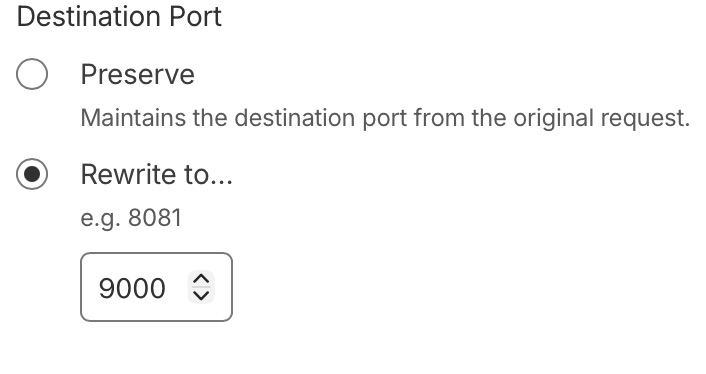

I've recently completed part 1 of my public infrastructure project. The goals I set were as follows:

1. Build and maintain a public-facing website. ✅ **Done!**
2. Deploy and manage infrastructure across multiple hardware architectures using automation and metrics.
3. Document the process publicly and publish the code on my [GitHub](https://github.com/iambryant).

This blog post will dive into how I got it done and the architectural decisions I made along the way.

## Choosing

I chose Hugo for this website as my requirements were fairly simple. I didn't need a database, user accounts, or the
overhead of a full Content Management System (CMS) such as WordPress. I found a Static Site Generator (SSG) to be a
much better fit.

I had also considered Jekyll, especially since it's the default choice for GitHub Pages and has excellent integration
there. I'll still be using it for any GitHub Pages websites I create but went Hugo here simply due to preference.

## Deployment & Automation

My [GitHub repository here](https://github.com/iambryant/public-infrastructure-playbook) contains the Ansible playbooks
I've written for configuring this website. It runs in this order currently:

- Run `site.yml`, which contains base configuration tasks such as:
  - Configuring the firewall
  - Configuring NTP
  - Configuring sshd
- Run `configure_dmz_web.yml`, which:
  - Configures the firewall to only allow traffic from Cloudflare's [IP Ranges](https://www.cloudflare.com/ips/)
    (more info below)
  - Installs and configures Certbot to generate certs for the webserver before Apache is configured
  - Installs and configures Apache with base configuration
  - Installs [Hugo](https://gohugo.io)
  - Installs and configures [adnanh/webhook](https://github.com/adnanh/webhook)
  - Configures webhook deployment users, scripts, etc.

I use GitHub's Actions and runners to handle any changes I make to my website code. My current
[GitHub workflow](https://github.com/iambryant/xserve-cc/blob/main/.github/workflows/ci.yml) consists of two
jobs:

```yaml
jobs:
  lint:
    name: Lint Markdown
    runs-on: ubuntu-latest
    steps:
      - name: Check out the codebase.
        uses: actions/checkout@v7

      - name: Lint Markdown files
        uses: DavidAnson/markdownlint-cli2-action@v23.2.0
        with:
          globs: '**/*.md'

  deploy:
    runs-on: ubuntu-latest
    needs: lint
    steps:
      - name: Trigger webhook to deploy Hugo website
        uses: distributhor/workflow-webhook@v3.0.8
        with:
          webhook_url: 'http://xserve.cc/hooks/deploy-hugo-website'
          webhook_secret: ${{ secrets.WEBHOOK_TOKEN }}
          webhook_type: 'json-extended'
```

The first is self-explanatory; it lints the markdown files in the repository to make sure I formatted
everything correctly.

The second job deploys the code by sending a webhook to my webserver. The deployment script contains these steps: 

```shell
#!/bin/sh

REPO_DIR="/var/webhook/xserve-cc"
REPO_URL="https://github.com/iambryant/xserve-cc.git"
LOG_FILE="/var/webhook/hugo.log"

# Clone or Update the repository
if [ -d "$REPO_DIR/.git" ]; then
    cd "$REPO_DIR" && /usr/bin/git pull
else
    /usr/bin/git clone "$REPO_URL" "$REPO_DIR"
fi

# Build the Hugo site
/usr/local/bin/hugo -s "$REPO_DIR" -d /var/www/html --cleanDestinationDir --noTimes > "$LOG_FILE" 2>&1
```

The repository is pulled/cloned to the webhook user's home directory, and then deployed with Hugo. I could
technically do this in the GitHub workflow if I wanted the Hugo deployment to be more portable, since Hugo just converts
all the markdown files to HTML, and the webserver wouldn't need Hugo installed. I may eventually rotate the blog between
AIX, HP-UX, and Solaris hosts, and having just the HTML files on them would be cleaner than attempting to get Hugo
running on each OS.

## Architectural Decisions

Now that I've covered the deployment pipeline, I can talk about some problems I encountered. Initially I
thought of restricting the IPs that could trigger the webhook to the GitHub Actions runner IP ranges at
[GitHub's public API endpoint](https://api.github.com/meta), like this:

```yaml
- name: "Fetch GitHub's CIDR blocks"
  ansible.builtin.uri:
    url: https://api.github.com/meta
    method: GET
    return_content: true
  register: github_cidr_blocks_raw
  run_once: true # To prevent hammering GitHub's servers if running on multiple hosts

- name: "Ensure GitHub's CIDR blocks are set as facts"
  ansible.builtin.set_fact:
    github_actions_cidr_blocks_v4: "{{ github_cidr_blocks_raw.json.actions | select('search', '\\.') | list }}"
    github_actions_cidr_blocks_v6: "{{ github_cidr_blocks_raw.json.actions | select('search', ':') | list }}"

- name: "Ensure firewall rules are applied"
  ansible.builtin.include_role:
    name: fedora.linux_system_roles.firewall
  vars:
    firewall:
      - ipset: github_actions_cidr_blocks_v4
        ipset_type: hash:net
        ipset_entries: "{{ github_actions_cidr_blocks_v4 }}"
        state: present

      - ipset: github_actions_cidr_blocks_v6
        ipset_type: hash:net
        ipset_entries: "{{ github_actions_cidr_blocks_v6 }}"
        state: present

      - zone: github
        state: present

      - zone: github
        source:
          - "ipset:github_actions_cidr_blocks_v4"
          - "ipset:github_actions_cidr_blocks_v6"
        port:
          - "{{ webhook_port }}/tcp"
        state: enabled
```

I got this idea from Jeff Geerling's video,
[How I survived a DDoS attack](https://www.youtube.com/watch?v=VPcYMgTYQs0&themeRefresh=1), where he mentioned
restricting the firewall on his VPS to Cloudflare's IP ranges to prevent bypassing Cloudflare's protective
mechanisms.

However, I noticed that when I tried sending a webhook from a GitHub runner, it would fail each time. I tried disabling
the firewall on my webserver thinking that I had configured the rules incorrectly. When that failed, I tried switching
Cloudflare's proxy (which my website is behind) from orange cloud to grey cloud. Suddenly, it worked. Why?

Cloudflare is sort of a complicated beast. It's a hybrid between a Web Application Firewall (WAF) and a reverse proxy.
The first issue that was causing failures was the origin IPs. Since Cloudflare proxies traffic, it doesn't just pass
traffic through; it will actively rewrite the IPs. This meant that I had to change my firewall rules to allow web
traffic from Cloudflare's IP ranges, not GitHub's:

```yaml
- name: "Fetch Cloudflare's CIDR blocks (IPv4)"
  ansible.builtin.uri:
    url: https://www.cloudflare.com/ips-v4
    return_content: true
  register: cloudflare_cidr_blocks_v4_raw
  run_once: true # To prevent hammering Cloudflare's servers if running on multiple hosts

- name: "Fetch Cloudflare's CIDR blocks (IPv6)"
  ansible.builtin.uri:
    url: https://www.cloudflare.com/ips-v6
    return_content: true
  register: cloudflare_cidr_blocks_v6_raw
  run_once: true

- name: "Ensure Cloudflare's CIDR blocks are set as facts"
  ansible.builtin.set_fact:
    cloudflare_cidr_blocks_v4: "{{ cloudflare_cidr_blocks_v4_raw.content.splitlines() }}"
    cloudflare_cidr_blocks_v6: "{{ cloudflare_cidr_blocks_v6_raw.content.splitlines() }}"

- name: "Ensure firewall rules are applied"
  ansible.builtin.include_role:
    name: fedora.linux_system_roles.firewall
  vars:
    firewall:
      - ipset: cloudflare_cidr_blocks_v4
        ipset_type: hash:net
        ipset_entries: "{{ cloudflare_cidr_blocks_v4 }}"
        state: present

      - ipset: cloudflare_cidr_blocks_v6
        ipset_type: hash:net
        ipset_entries: "{{ cloudflare_cidr_blocks_v6 }}"
        state: present

      - zone: cloudflare
        state: present

      - zone: cloudflare
        source:
          - "ipset:cloudflare_cidr_blocks_v4"
          - "ipset:cloudflare_cidr_blocks_v6"
        service:
          - http
          - https
        port:
          - "{{ webhook_port }}/tcp"
        state: enabled
```

There was still one more issue: the webserver was not receiving webhooks sent by GitHub runners. By default,
the webhook service listens on port 9000. Cloudflare, being designed for web traffic, sees it as a non-standard port
and drops it. There's multiple ways you could solve this, such as:

- Changing the webhook to listen on a different HTTP/HTTPS port that doesn't conflcit with the webserver but is still
  supported by Cloudflare, such as 8443 (you would need to specify this in your webhook URL since it's nonstandard)
- Creating an origin rule so that HTTP/HTTPS requests sent by GitHub get rewritten to port 9000

I went with the second option out of preference. The way I did it was through Cloudflare's
[origin rules:](https://developers.cloudflare.com/rules/origin-rules/)



Essentially, you tell Cloudflare to redirect URL paths starting with `/hooks` (the url the webhook service accepts
webhooks on) to port 9000. Whether GitHub sends it as HTTP or HTTPS, as long as it's a valid port to Cloudflare,
it'll rewrite it to port 9000.


