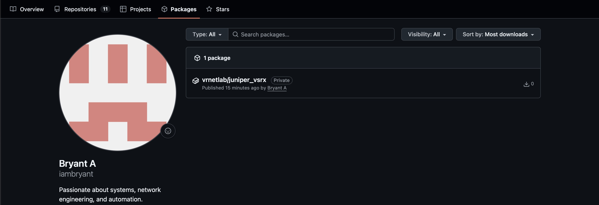

I use Juniper extensibly in my own environment, in fact, the first Juniper devices I ever worked on were an SRX240 and
an EX4500. Fast forward to today and I now own an SRX340, EX4300, QFX5100, and NFX250. However, while I've been heavily
moving my Linux/Unix infrastructure to more replaceable, automatable workflows, I've neglected the networking side.
I've been using the [juniper.device](https://galaxy.ansible.com/ui/repo/published/juniper/device/) collection for
automating configuration on my switches and firewalls so far but thought I'd make a collection for
common tasks/applications like ACME, VPNs, and ZTP. Of course, when writing software, CI/CD is a staple for making sure
your software works and adapts to different configurations/conditions. In this post I'll talk about possible solutions
and the differences between them.

## vSRX and cSRX

Aside from the physical Juniper SRX's that are available for use, Juniper offers the vSRX and cSRX products. You may
have heard about virtualizing your firewall or wanting to secure VMs in a cloud network. That's where the vSRX comes in.
On the other hand, you may want to secure containers behind a firewall, like in Kubernetes. That's one of the main
benefits of the cSRX. Since CI/CD often uses containers for quickly testing software, you might think the cSRX is also a
good solution. Unfortunately, I'll have to stop you there. While the vSRX and cSRX are both meant to act as firewalls,
the cSRX compromises on features compared to the vSRX (you can find the differences
[in this Juniper article](https://www.juniper.net/documentation/us/en/software/csrx/csrx-consolidated-deployment-guide/topics/concept/security-csrx-docker-feature-support.html)).
Since I mainly work with the SRX and vSRX, my Ansible playbooks are designed to run on those and I'd like the CI/CD
they're tested on to run on the equivalent infrastructure. Of course, if your needs are different from mine, or you've
found that the features the cSRX lacks don't matter for your use case, then feel free to use the cSRX image for your own
testing. However, having a vSRX container image is still handy if you need to test code on a vSRX in a container on an
environment like GitHub Actions or GitLab.

## Network Virtualization Tools

Let's discuss solutions for virtualizing network appliances. Technically, you can take a network appliance VM/container
image and just run it inside a traditional hypervisor/container solution. But you'll find this becomes very convoluted
once you want to start to create network topologies; you'll need to manually configure Linux bridges, VLANs, network
namespaces, etc. in order to wire them together, which can be very unintuitive. The two most common solutions for
solving this currently are GNS3 and EVE-NG. They work by running network appliances in VMs and handling the network
connections behind the scenes. The main drawback of them, though, is that they're heavy and designed for human
interaction, not for CI/CD. They utilize VMs behind the hood to run network appliances typically over KVM/QEMU. There is
another solution, called [containerlab](https://containerlab.dev), which is what I want to talk about today.
Instead of running VMs for each network appliance, which lengthens size and boot times, containerlab uses Docker behind
the scenes for running them. The issue with this approach, however, is that it obviously doesn't support VMs. The
network vendor you download images from will need to provide container images. Containerlab came up with a solution for
this, however, called vrnetlab. Vrnetlab is a simple tool that allows you to package VM-based network appliances into
container images so that you can run them alongside your native container images in Docker.

## Creating Container Images

Packaging VM-based network appliance images into container images is super simple with vrnetlab. I'll outline the
process here but if you want to read more about it you can visit [their guide here](https://containerlab.dev/manual/vrnetlab/).
It's also worth noting that this is best done on x86_64, since most network vendors compile their VM images for x86_64.
Another obvious requirement is Linux since this uses Docker.

First, you'll need to install containerlab. They provide a script for simplicity. Make sure to inspect it before
running:

`curl -sL https://containerlab.dev/setup | sudo -E bash -s "all"`

Now, we'll need to clone the vrnetlab repository to create the container image. You can use this command
(taken from the guide):

`git clone https://GitHub.com/srl-labs/vrnetlab`

Since we're making a container image for the Juniper vSRX, we'll navigate to the `vsrx` directory:

`cd vrnetlab/juniper/vsrx`

Each directory provides a readme on how to create the container image. Following its instructions, you'll need to do
these steps:

- Download the vSRX 3.0 trial `.qcow2` image from <https://support.juniper.net/support/downloads/?p=vsrx-evaluation>
  and place it in this directory. A Juniper account is required to download the evaluation image.
- After typing `make`, a new image will appear called `vrnetlab/juniper_vsrx`.
  Run `docker images` to confirm this.

Unless you're specifically making a container image for the vSRX 2.0 architecture, you can ignore any mentions of it.
vSRX 2.0 is a long obsolete implementation of the vSRX appliance that splits its function into two VMs rather than
one like vSRX 3.0.

> **Note**: Don't worry about the fact that the vSRX evaluation images say they have a 60-day limit. If you're using
> them for ephemeral workflows, a fresh instance will be used each time, resetting the timer. The limit only applies if
> you're running the vSRX as a long-lived appliance.

Once it's installed, we can create a simple topology file to get a basic vSRX container running. We'll use the local
Docker image that was created (change the tag if you created the container based on a different release of vSRX):

```yaml
name: vsrx-testing
topology:
  nodes:
    vsrx-01:
      kind: juniper_vsrx
      image: vrnetlab/juniper_vsrx:23.4R2-S5.5
```

Now, you can run `sudo containerlab deploy`. It should take 5-10 minutes for the vSRX to boot (it's a VM booting in a
Docker container, after all).

Once you're able to run `docker logs <container_name>` and it returns this message, you're in business:

```text
FreeBSD/amd64 (vsrx-01) (ttyu0)

login: 2026-08-15 04:28:09,382: launch  INFO VM started
2026-08-15 04:28:09,382: base_driver    INFO closing connection to '127.0.0.1' on port '5000'
2026-08-15 04:28:09,382: base_driver    INFO connection to '127.0.0.1' on port '5000' closed successfully
2026-08-15 04:28:09,383: launch         INFO Startup complete in: 0:06:44.317386
```

Containerlab should've autogenerated an SSH config when you ran deploy to make it easier to SSH into the container.
If you forgot the name of it, you can run `docker ps` to see its name again. You can then use that name to SSH into it.
The default credentials should be `admin` for the username and `admin@123` for the password.

You should get an SSH prompt, and entering the password should drop you straight into the vSRX shell!

```text
Last login: Sat Aug 15 04:30:11 2026 from 172.20.20.1
--- JUNOS 23.4R2-S5.5 Kernel 64-bit XEN JNPR-12.1-20250430.960aa75_buil
```

## Pushing the Image to a Registry

Now that we've created a working container image for the vSRX, you probably want to reuse it for CI/CD workflows. Before
pushing it, I want to err on the side of caution and warn you to not push the image publically. **Juniper appliances like
the vSRX and cSRX are licensed products and aren't allowed to be distributed.** I'll be uploading my image to GitHub's
Container Registry for native integration with my runners so keep reading if you'd like to learn how to do it safely.

Following [GitHub's guide here](https://docs.GitHub.com/en/packages/working-with-a-GitHub-packages-registry/working-with-the-container-registry),
we'll need to create a Personal Access Token (PAT) to be able to authenticate with their registry. On the GitHub home
page, click on your profile in the top right corner, then click `settings`. In settings, you'll want to click on
`credentials` and select `Personal access tokens (classic)`. You'll then click on `Generate new token`, and opt to
generate a classic token. You can use GitHub's notes in the guide to decide what permissions you'll want to use for the
token. I'm going to go with just `write:packages` so that I can upload the image:

```text
By default, when you select the write:packages scope for your personal access token (classic) in the user interface,
the repo scope will also be selected. The repo scope offers unnecessary and broad access, which we recommend you avoid
using for GitHub Actions workflows in particular. For more information, see Compromised runners. As a workaround, you
can select just the write:packages scope for your personal access token (classic) in the user interface with this url: 
<https://github.com/settings/tokens/new?scopes=write:packages>.
- Select the read:packages scope to download container images and read their metadata.
- Select the write:packages scope to download and upload container images and read and write their metadata.
- Select the delete:packages scope to delete container images.
```

After you've created the token, you should copy it and store it somewhere safe for reusability. Now we can use it to
login to the registry with Docker. Again, following GitHub's guide, you can use the following commands:

```text
Save your personal access token (classic). We recommend saving your token as an environment variable.

export CR_PAT=YOUR_TOKEN
Using the CLI for your container type, sign in to the Container registry service at ghcr.io.

$ echo $CR_PAT | docker login ghcr.io -u USERNAME --password-stdin
> Login Succeeded
```

Once you received `Login Succeeded`, you'll need to tag the image to be able to push it to their registry:

```text
user@testvm:~$ docker images
REPOSITORY                                TAG           IMAGE ID       CREATED        SIZE
vrnetlab/juniper_vsrx                     23.4R2-S5.5   d9c3225ec439   19 hours ago   1.3GB

user@testvm:~$ docker tag d9c3225ec439 ghcr.io/iambryant/vrnetlab/juniper_vsrx:23.4R2-S5.5

user@testvm:~$ docker images
REPOSITORY                                TAG           IMAGE ID       CREATED        SIZE
vrnetlab/juniper_vsrx                     23.4R2-S5.5   d9c3225ec439   20 hours ago   1.3GB
ghcr.io/iambryant/vrnetlab/juniper_vsrx   23.4R2-S5.5   d9c3225ec439   20 hours ago   1.3GB

user@testvm:~$ docker push ghcr.io/iambryant/vrnetlab/juniper_vsrx:23.4R2-S5.5
The push refers to repository [ghcr.io/iambryant/vrnetlab/juniper_vsrx]
ce9e217ed60f: Pushed 
71b0ef9c7411: Pushed 
923c7950b782: Pushed 
0c416208e642: Pushed 
de30d8503ad3: Mounted from srl-labs/vrnetlab-base 
fc0da4285c1d: Mounted from srl-labs/vrnetlab-base 
5d88209bab3b: Mounted from srl-labs/vrnetlab-base 
74523ebcfaac: Mounted from srl-labs/vrnetlab-base 
611fcc0c48d8: Mounted from srl-labs/vrnetlab-base 
072209ca18d3: Mounted from srl-labs/vrnetlab-base 
f4f8b983b714: Mounted from srl-labs/vrnetlab-base 
23.4R2-S5.5: digest: sha256:67b11f721afeb755add96da7a71e9d5d1b3151fb88d91a9f1610475ea836bcca size: 2625
```

Once the command completes successfully, you can click on your profile in the top right corner in GitHub, click the
`profile` tab, then click on the `Packages` tab in your profile, and the image should be uploaded:



If you click on the image, and then click on `Package settings`, and scroll to the bottom, you should see that GitHub
already made the package visibiliy private for you.
