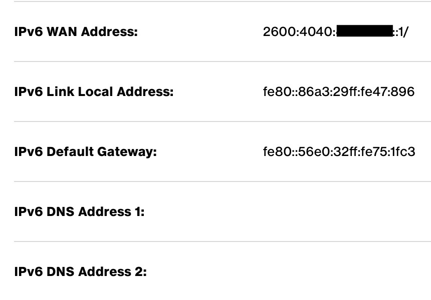
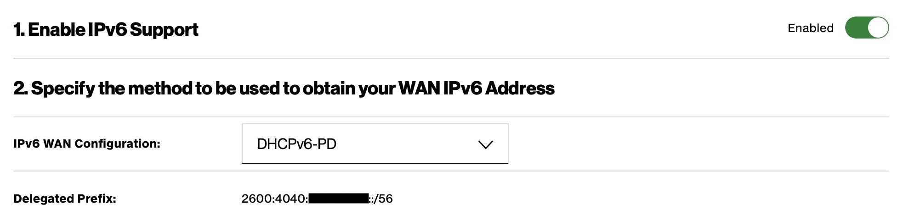

It's finally time to check off something on my to-do list: IPv6. I've actually been looking forward to migrating to
IPv6: no more NAT, being able to use public IP blocks, and feeling superior to IPv4 users. However, ISPs like Verizon
or Comcast aren't really clear on how to utilize IPv6 when using your own routers. Plus, it requires some additional
configuration since it isn't a given like IPv4 is. I did some testing with my ISP provided Verizon router and my own
Juniper SRX and thought I'd write this blog post for anyone looking to enable IPv6 in their own environment.

> **Note**: This blog was tested on a WIRED (fiber-optic) service via Verizon. I'm not sure if it applies to Verizon's
> 5G service or other 5G internet services. Your mileage may vary.

## IPv6 on Verizon Routers

Most people just use their ISP provided router and have access to IPv4 and IPv6 services easily. However, none of
the back-end configuration or how it's done is documented or available to view in their web UI. If I swap out my SRX
for the Verizon provided router, I can check the connection status for IPv6 by navigating to Advanced > Network Settings
\> Network Connections and clicking on `Broadband Connection (Ethernet)`:



And if I navigate to Advanced > Network Settings > IPv6, I can see the prefix that was delegated to the router:



There's some technicalities to note here:

- Verizon does not use stateful DHCPv6 for residential internet connections. They use stateless DHCPv6 + SLAAC instead.
  If you are new to IPv6 like me, you may be confused by this as you'll only receive a link local IP, but this is
  expected as IPv6 is designed for devices to only use link local IP addresses as their gateway.
- The IPv6 WAN address shown in the UI appears to be the first IP in a subnet in your delegated prefix. This implies
  that the router got it via stateful DHCPv6. This is not true. The router takes a subnet from the delegated prefix
  and gives itself an IP from that subnet (commonly the first IP). This is only used so that Verizon can talk to your
  router from their end for things like diagnostics and uptime checks.

## IPv6 on the Juniper SRX

This is the following configuration that I've got working on my SRX for enabling IPv6 connectivity to Verizon, using
this [Juniper guide here](https://www.juniper.net/documentation/us/en/software/junos/dhcp/topics/topic-map/dhcpv6-client-security-devices.html)

```text
set security forwarding-options family inet6 mode flow-based
set security zones security-zone UNTRUST interfaces ge-0/0/0.0 host-inbound-traffic system-services dhcpv6
set interfaces ge-0/0/0 unit 0 family inet6 dhcpv6-client client-type stateful
set interfaces ge-0/0/0 unit 0 family inet6 dhcpv6-client client-ia-type ia-pd
set interfaces ge-0/0/0 unit 0 family inet6 dhcpv6-client client-identifier duid-type duid-ll
```

To explain the set commands used:

- SRX firewalls, which use flow mode by default, don't process IPv6 traffic out of the box. This option will enable it
  (requires a reboot).
- The second command allows DHCPv6 in to your WAN interface in its respective security zone so that it can act as a 
  DHCPv6 client.
- The third command sounds misleading but is required for enabling prefix delegation. Even though your connection to
  Verizon is stateless, prefix delegation is inherently a stateful thing so Junos requires you to use the parameter
  `stateful` rather than `autoconfig` (which implies stateless).
- The fourth command tells the WAN interface to request a block of IPv6 IPs so that they can be used for LAN addresses.
- The fifth command is used for client identification so that Verizon can hand out things like DNS info.

This configuration should be applicable to non-SRX Juniper families like the ACX or MX. You don't need to run
`set security forwarding-options family inet6 mode flow-based` since packet-based devices process IPv6 natively.
Additionally, instead of allowing DHCPv6 into your WAN interface through a security zone, you'll use a stateless filter
under the `firewall` stanza.

> **Note**: You will also need to allow DHCPv6 in through a stateless firewall filter on the SRX if you're protecting
> the loopback (lo0) interface through a firewall filter like `PROTECT-RE` since the DHCPv6 client traffic needs to
> reach the Routing Engine.

You can also use this set command if you also want your Juniper device to request DNS servers from the upstream WAN, but
Verizon currently doesn't offer IPv6 DNS servers:

```text
set interfaces ge-0/0/0 unit 0 family inet6 dhcpv6-client 
```

We can see here now that the SRX has successfully received a delegated prefix and a default route:

```text
show route table inet6.0                    

inet6.0: 4 destinations, 4 routes (4 active, 0 holddown, 0 hidden)
+ = Active Route, - = Last Active, * = Both

::/0               *[Access-internal/12] 00:00:26
                    >  to fe80::56e0:32ff:fe75:1fc3 via ge-0/0/0.0
2600:4040:xxxx:xxxx::/56
                   *[Access-internal/12] 00:00:39
                       Reject
fe80::ee38:73ff:fe9b:81a5/128
                   *[Local/0] 00:00:52
                       Local via ge-0/0/0.0
ff02::2/128        *[INET6/0] 1d 07:38:03
                       MultiRecv
```

> **Note**: You might not receive a default route immediately after enabling router-advertisement under protocols. 
> This is because router advertisements are periodic. If you wait a couple of minutes, it should appear.
